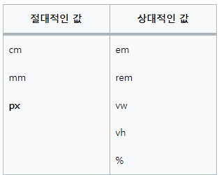

# CSS

- 드림코딩 Youtube 참고

1. 드림코딩 CSS 레이아웃 정리 display, position 완벽정리
   <https://youtu.be/jWh3IbgMUPI>

### 참고사이트

1. MDN css Reference
   <https://developer.mozilla.org/ko/docs/Web/CSS/Reference>

2. FlexBox 참고
   <https://css-tricks.com/snippets/css/a-guide-to-flexbox/>

3. mdn flexbox
   <https://developer.mozilla.org/en-US/docs/Web/CSS/CSS_Flexible_Box_Layout/Basic_Concepts_of_Flexbox>

4. FlexBox Froggy
   <https://flexboxfroggy.com/#ko>

## 1. 의미 , 정의

- Cascading Style Sheet
- Cascade : 폭포처럼 쏟아지는 물
- 정의된 세부적인 명시가 있다면, 그것을 사용하고, 정의가 되어있지 않다면 Browser의 기본 스타일을 따라간다.

## 2. 스타일

### CSS 스타일

- Author Style (우리가 지정해놓은 스타일) → User Style → Browswer Style

### **important**

```css
!important
```

- !important 명령어는 제일 중요한 Style이라는 것을 명시한다.
- 가능하면 쓰지않는 것이 좋다!

### selectors

1. universal : \* (전체)
2. type : tag (div, span)
3. ID : #id (#name)
4. class : .class (.item, .username)
5. state : ':'(:hover, :click)

### pading , margin

- top / right / bottom / left 순서로 선언가능(시계방향)

```css
.red {
  width: 100px;
  height: 100px;
  padding: 20px 20px 20px 20px;
  margin: 15px 10px 12px 5px;
}
```

- 인수가 2개 일때는 top + bottom / right + left에 대한 값을 삽입하는 경우

```css
.red {
  padding: 20px 0px;
  /* top + bottom = 20px padding */
  /* right + left = 0px padding */
}
```

### border

- border-width, border-style, border-color
- width / style / color

```css
.red {
  border: 2px solid red;
  /*width = 2px
  style = solid
  color = red */
}
```

## 2. display & position

### display

- block level 엘리먼트와 inline level 엘리먼트를 이용한다.

- inline level 태그를 block 속성으로 변경

```css
div {
  display: block;
}
```

- inline은 기본적으로 contents 만을 꾸며주기 때문에, contents (내용)이 없는 엘리먼트는 표시되지 않는다.
- block 인 div를 contents(내용)없이 display 속성을 inline으로 바꾸면 표시되지 않는다.

- **inline-block**

  - inline 단위의 block 으로 엘리먼트를 표시한다.

- inline : 물건에 집중
- inline-block : 상자인데 한줄에 여러개 진열
- block : 상자인데 한줄당 하나만 놓음

## position

    - Element의 Default position 은
    'static' 으로 지정된다.

### **relative**

- 원래 유지되어야 하는 속성 과는 다르게 사용자가 지정한 위치로 포지셔닝할수있게한다.
- 원래 아이템이 있어야 하는 자리에서 '상대적으로' 이동
  ```css
  div {
    position: relative;
  }
  ```

### **absolute**

- 엘리먼트를 포함하고 있는 부모의 위치를 참조한다.
  ```css
  div {
    position: absolute;
  }
  ```

### **fixed**

- box에서 완전히 벗어나 winodw의 개념 단위에 포지션 하게 된다.
  ```css
  div {
    position: fixed;
  }
  ```

### **sticky**

- 원래있어야 하는 자리에 유지하면서 스크롤이 내려가도 그 위치를 그대로 지킨다.

```css
div {
  position: sticky;
}
```

## 3. FlexBox

1. Box에 적용 할 수 있는 속성 (Container)

- display / flex-direction / flex-wrap / flex-flow / justify-content / align-items / align-content

2. Item 에 적용할수 있는 속성

- order / flex-grow / flex-shrink / flex / align-self

3. FlexBox는 중심축과 수평축이 존재

- Item 들을 각 Row씩 나타낼 때 중심축 : Y축 수직축 : X축

- ITem 들을 각 Column 단위씩 나타낼때, 중심축 : X 축 수직축 : Y축

---

## 4. 반응형 단위 총정리

- < 참고 블로그>
  1. <https://velog.io/@uni/CSS-%EB%B0%98%EC%9D%91%ED%98%95-%EC%9B%B9%EC%9D%84-%EB%A7%8C%EB%93%A4%EB%95%8C-%EC%96%B4%EB%96%A4-%EB%8B%A8%EC%9C%84%EB%A5%BC-%EC%93%B0%EB%8A%94%EA%B2%8C-%EC%A2%8B%EC%9D%84%EA%B9%8C>

> 먼저보는 요약

1. em은 자신의 부모의 요소(font-size)를 기반으로 계산을 한다.
   (부모의 font-size를 곱한값으로 게산)
2.

> 사이즈의 종류

- 기본적으로 브라우저에서 폰트에 지정하는 크기는 16px
- 절대적인 값의 단위 (px)
- 상대적인 값의 단위 (em, rem, vh, vw ...)
- 사이즈 유닛 표

  

  > <span style="color:#75C2F6">**em**</span>

  - 선택된 font-family에 상관없이 항상 고정된 폰트 사이즈를 가지고 있음
  - 현재 font-size = 16px 이라면 1em = 16px 이 됨

  ```html
  <style>
    .parent {
      font-size: 8em;
    }
    .child {
      font-size: 0.5em;
    }
  </style>

  <div class="parent">
    Parent
    <div class="child">Child</div>
  </div>
  ```

  - em 이라는 CSS 반응형 단위는 부모 요소의 font-size에 기반하여 크기를 계산한다
  - parent 의 8em은 자신의 부모인 html을 기반으로 하여 8\*16px = 128px 이 됨
  - child는 부모인 parent 요소를 기반으로 하여 128px \* 0.5 = 64px 이 된다.
  - 8em = 800%로 볼수 있다.

  <br>

  > <span style="color:#75C2F6">**rem**</span>

  - 루트의 요소에 기반하여 사이즈가 계산되어짐
  - 루트 = html

    ```html
    <style>
      .parent {
        font-size: 8rem;
        /* html 16px * 8 = 128px */
      }
      .child {
        font-size: 0.5rem;
        /* html 16px * 0.5 = 8px */
      }
    </style>

    <div class="parent">
      Parent
      <div class="child">Child</div>
    </div>
    ```

> **vw**

- view port 의 너비에 기반하여 넓이 값을 계산한다
- 50vw = 브라우저 넓의 절반을 사용 (50%)
- vmin, vmax 사용 가능

> **vh**

- view port 의 높이에 기반하여 값을 계산
- 10vh = 브라우저 높이의 10% 사용
- vmin, vmax 사용 가능

## 5. em 과 rem의 사용

> 반응형 단위에 대한 사용 기준

- Parent 기준 vs Browser 기준

  - Parent 기준
    : em , %
  - Browser 기준 : vh, vm (v\*), rem

- 요소의 너비와 높이 (box) 기준 vs font-size 기준
  - box 기준 : %, v\*
  - font size 기준 : em, rem
