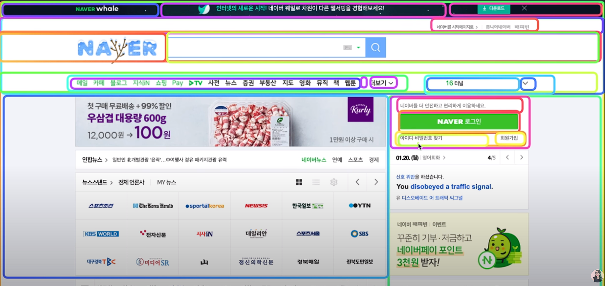
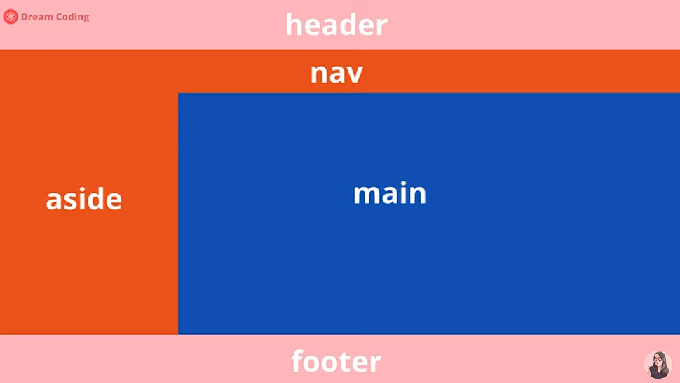
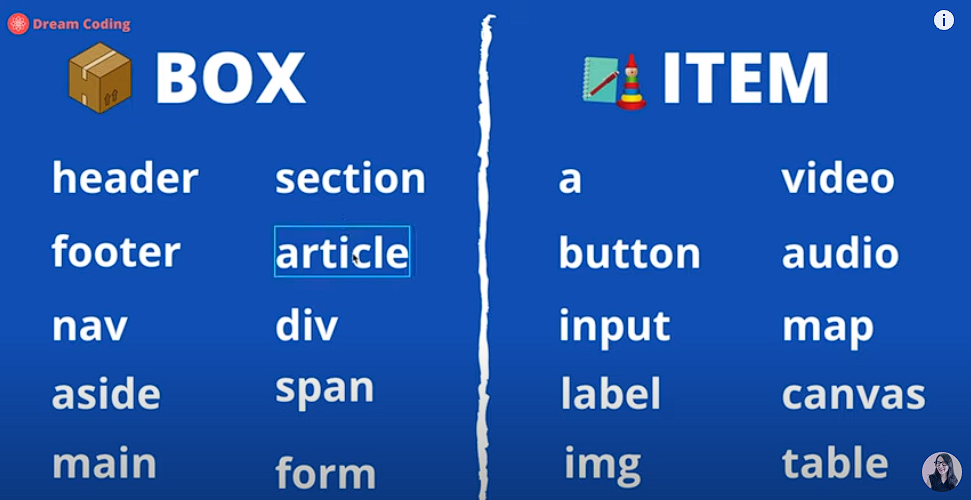
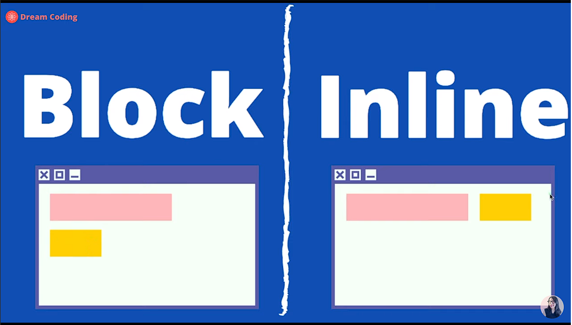

# HTML

### 참고 사이트

- 드림코딩 youtube 참고

1. MDN HTML Tags
   <https://developer.mozilla.org/ko/docs/Web/HTML/Element>

2. Markup Validataion
   <https://validator.w3.org/>

3. MDN Website Structure
   <https://developer.mozilla.org/ko/docs/Learn/HTML/Introduction_to_HTML/Document_and_website_structure>

### 웹사이트를 박스단위로 나누어서 볼 수 있어야 된다.



## Tags

- HTML 태그는 아무리 많아도 2종류로 나뉜다.
- BOX or ITEM 태그로 나뉜다!




- Block & Inline
  

* html 태그 선언 팁

```html
div.container>div.item.item$($)*10
```

- 위처럼 작성하고 자동완성 하면,
  div .container 내에 div.item.item(순번)인 태그가 완성
