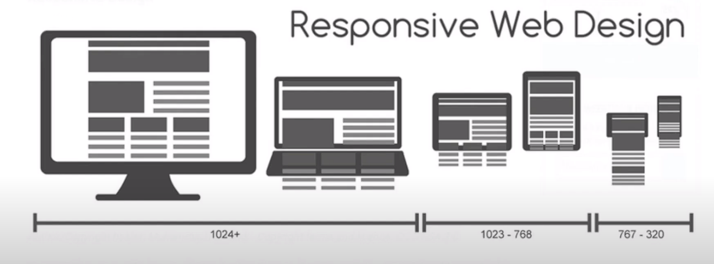

# Responsive Web

> > > 참고강의

1. 드림코딩 Responsive Web <br>
   : <https://youtu.be/8-uJ_4136uI>

> > > 참고사이트

1. MDN Using media queries <br>
   : <https://developer.mozilla.org/en-US/docs/Web/CSS/CSS_media_queries/Using_media_queries>

> 반응형 웹

- 반응형 웹
- 반응형을 고려하지 않은 웹사이트는 어떤 플랫폼에서든지 <span   style="color:#97FEED">사용자가</span> 콘텐츠를 이용하기 편해진다.

- 반응형으로 잘 만들어진 웹사이트
  1. Github
  2. klientboost : <https://klientboost.com/>
  3. magicleap : <https://www.magicleap.com/en-us/>

<hr>

> 예전의 유동적인 레이아웃 코드

```css
.left {
  float:left;
  width:50%;
}

.right {
  float : right;
  width : 50%
}`
```

> 요즘의 유동적인 레이아웃 코드

- <span style="color:#468B97">Flex grid</span>
- <span style="color:#468B97">Flex Box</span>
- <span style="color:#468B97">% , vw , Vh</span>
- <span style="color:#EF6262">px 🚫</span>

> Media Queries

  

```css
@media screen and (min-width: 800px) {
  .container {
    width: 50%;
  }
}
```

```css
@media screen and (max-width: 800px) {
  .container {
    width: 100%;
  }
}
```
