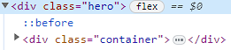

# Travelix Clone Coding

> 사용 Skill

- HTML
- CSS
- Vanila JavaScript

## HTML

## CSS

> gradient 설정

```css
:root {
  --gradient-color: linear-gradient(
    to right,
    var(--yellow-solid),
    var(--purple-light)
  );
  --gradient-color-alt: linear-gradient(
    to right,
    var(--purple-light),
    var(--yellow-solid)
  );
}
```

> color : inherit 속성

```css
div {
  color: gray;
}

div a {
  color: inherit;
}
```

- inherit 속성은 자신의 부모의 속성을 **상속받는** 명령이다.
- 위 코드에서 div 안에 들어있는 a 태그 들은 자신의 부모인 div 태그의 color를 상속받게 된다

- linear-gradient(방향/각도, 색상1, 색상2) 의 인수를 받는다 (선형 gradient)

- 참고링크:
  <https://penguingoon.tistory.com/267>

> z-index

- 요소간의 표시 우선순위를 주기 위한 속성
- z-index의 값이 클루속 뒤로 보내지고, 낮을수록 앞으로 나오게 된다

```css
.nav {
  z-index: 999;
}
```

> opacity

- 요소의 투명도를 설정 할 수 있다
- 0.0 ~ 1.0 까지 설정
- 0 은 완전 투명

> transform : scale()

- transform : 변형
- scale : 크기변경, scale(x,y) 인수를 받으며, 1은 크기그대로, 2부터 2배를 받고 0은 완전히 화면상에서 지운다

> ::before , ::after

- 가상요소
- 일반적인 CSS 선택자 로는 지정할수 없는 미세한 영역을 선택하기 위해 사용됨

  

```css
.hero::before {
  content: "";
  position: absolute;
  top: 0;
  left: 0;
  width: inherit;
  height: inherit;
  background-color: var(--purple-transparent-alt);
  z-index: -1;
}
```

```
<div class="hero">
::before
-------contents
::after
</div>
```

> resize

- resize는 form이나 label, select 같은 요소를 사용자가 resizing 할 수있는지의 여부와 resize 방향에 대한 정의를 위해 사용
- none, horizontal, vertical , both 등등으로 사용 가능
- none 일 때는, 사용자가 input 요소의 사이즈를 조정할 수 없다

- 위와 같은 스타일, 컨텐츠, 요소 자체를 지정한 엘리먼트의 앞 뒤에 배치 할 수 있다

> grid

- grid 알아보기

## JS

> classList.toggle

```js
let header = document.querySelector(".header");
let hamburgerMenu = document.querySelector(".hamburger-menu");

hamburgerMenu.addEventListener("click", function () {
  // console.log(header.classList);
  header.classList.toggle("menu-open");
});
```

- 위의 코드 분석

  1. .header 와 .hamburger-menu 를 document.querySelector로 할당 (header, hamburgerMenu)
  2. hamburgerMenu가 Click 될 떄의 이벤트 추가
  3. header 요소에 바로 밑에 .menu-open div toggle

- 수행

  - hamburgerMenu 클릭 전 header 태그 상태

  ```html
  <header class="header">...</header>
  ```

  - hamburgerMenu 클릭 후 header 태그 상태

  ```html
  <header class="header menu-open"></header>
  ```
