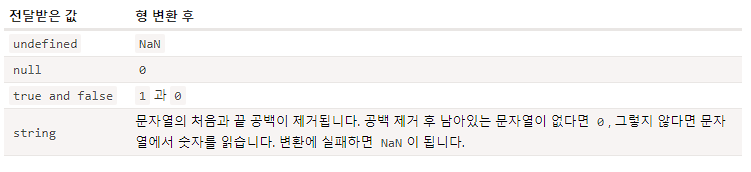

# JS INFO - JS 기본

## 문(statement)

> <https://ko.javascript.info/structure>

- **Statement** 는 어떤 작업을 수행하는 문법구조와 명령어 를 의미한다

```JS
alert('Hello'); alert('World');
```

- 세미콜론 (;) 은 문의 끝을 의미
- 줄바꿈으로 세미콜론을 대체할 수 있다.

- 대부분의 경우, 줄바꿈은 세미콜론을 의하지만, 모두의 경우는 아님

```js
alert(3 + 1 + 2);
```

- **세미콜론으로 문(StateMent) 를 마무리하는 습관을 가져야 한다**

## **주석**

- 한줄짜리 주석

```js
//
```

- 여러줄 주석

```js
/* */
```

- 주석 단축키

  1. 한줄 : Ctrl + /
  2. 여러줄 : Ctrl + Shift + /

- 주석은 중첩이 되지 않는다!

- 주석을 다는 것을 두려워 하면 안된다. 주석이 많다고 해서 배포되는 코드에 영향을 주지않는다

## 엄격모드 (strict)

- 레거시 JS와 ES5의 기능적인 부분이 다르기 떄문에, 레거시 JS 코드에서는 기존의 레거시함을 유지하기 위해 고안된 기능

- Strict Mode는 JS 코드에 모던함을 불러온다.

- Strict Mode 선언 방식

```js
"use strict";
// 이 코드는 모던한 방식으로 실행됨
```

- 사용하는 JS 코드의 최 상단에 'use strict' 를 사용함으로 써 JS의 Modern을 사용

> 'use strict' 최상단에 위치시켜야 하는 이유

```js
alert("some code");

("use strict");

// 엄격 모드가 활성화 되지 않는다.
```

- 모던 자바스크립트 는 Class 나 import 구문을 활용하게 되면 자동 적용 된다.

  → Class와 Import가 최신 문법이기 떄문

## 변수와 상수

- 변수는 정보를 저장 (값을 저장)하는 목적으로 사용된다

### 1. 변수

```js
let message;
message = "hello";
//문자열을 저장한다.
```

```js
//한줄에 여러변수 선언 (비추)
let user = "John",
  age = 25,
  message = "hi";
```

```js
//가독성 좋은 변수 선언
let user = "john";
let age = 25;
let message = "hello";
```

- 변수 명명 규칙

  - Camel Case

  1. 변수명에는 오직 문자와 숫자 $, \_ 만들어갈수 있다.
  2. 첫글자는 숫자가 될수 없다.

### 2. 상수

- 상수는 변하지 않는 값을 저장할때 사용
- 상수 선언때는 const를 활용한다.

```js
const myBirthday = "11.02.1999";
```

- 기억하기 힘든 값, 정해놓고 사용하는 값을 상수로 사용 하면 된다.

```js
const COLOR_RED = "#F00";
const COLOR_GREEN = "#0F0";
const COLOR_BLUE = "#00F";
const COLOR_ORANGE = "#FF7F00";
```

> 바람직한 변수명

- userName 이나 shoppingCart처럼 사람이 읽을 수 있는 이름을 사용하세요.

- 무엇을 하고 있는지 명확히 알고 있지 않을 경우 외에는 줄임말이나 a, b, c와 같은 짧은 이름은 피하세요.

- 최대한 서술적이고 간결하게 명명해 주세요. data와 value는 나쁜 이름의 예시입니다. 이런 이름은 아무것도 설명해주지 않습니다. 코드 문맥상 변수가 가리키는 데이터나 값이 아주 명확할 때에만 이런 이름을 사용합시다.

- 자신만의 규칙이나 소속된 팀의 규칙을 따르세요. 만약 사이트 방문객을 'user’라고 부르기로 했다면, 이와 관련된 변수를 currentVisitor나 newManInTown이 아닌 currentUser나 newUser라는 이름으로 지어야 합니다.

## 자료형

- JS 에는 8가지 자료형이 존재

### 1. 숫자형 (number)

- 정수 및 부동소수점 숫자 (float)
- 사칙연산
- 'Infinity', '-Infinity', 'NaN' 같은 특수숫자값이 존재

> **NaN**

- 계산중의 에러가 발생한것을 나타내느 값
- 부정확 하거나 정의되지 않은 수학연산을 수행시 에러가 발생하고 이때 NaN을 반환

```js
let calc1 = "숫자가아님" / 2; //NaN
let calc2 = "숫자가아님" / 2 + 5; //NaN
```

- NaN에는 어떠한 추가연산을 수행해도 값이 바뀌지 않는다.

> **BigInt**

- JS 에서는 2^53-1
  = 9007199254740991 보다 큰값 혹은
  -9007199254740991 보다 작은 정수는
  단순한 Number를 사용하여 나타낼수 없다

- BigInt는 길이에 상관없이 정수를 나타낼수 있다.

```js
const bigInt = 123123123123123123121324235245324542524523423423414n;
```

- Number의 끝에 **'n'** 을 붙여 BigInt형을 사용

### 2. 문자형 (String)

- String 의 표현 방식

  ```js
  //1. 큰따옴표
  let str1 = "Hello";

  //2. 작은 따옴표
  let str2 = "Hello";

  //3. 역 따옴표 (백틱)
  let str3 = `Hello`;
  ```

- 백틱 (`) 은 ${변수} 를 사용하여 문자열 안에 변수를 사용할수 있다.

```js
let userName = "John Doe";
console.log(`Hello I'm ${userName}`);
// Hello I'm John Doe
```

### 불린형 (Boolean)

- true / false 두가지만 존재

### null 값

- 어느 자료형에도 속하지 않은 고유의 값
- null 값은 오로지 null값만 포함하는 별도의 자료형
- JS 의 null
  = 존재하지 않는값, 비어있는 값, 알수없는값

### undefined 값

- null 값과 같이 자신만의 자료형으로 존재
- 값이 할당되지 않은 상태를 나타낸다.
- 변수는 선언 했지만 값을 할당 하지 않았다면 undefined 가 자동할당됨

```js
let age;
console.log(age);
// undefined
```

### typeof 연산자

- 사용 방식

  1. 연산자 : typeof x
  2. 함수 : typeof(x)

  - 둘의 결과값은 같다
  - x의 자료형을 문자열(String)으로 반환 한다.

  ```js
  typeof undefined; // "undefined"
  typeof 0; // "number"
  typeof 10n; // "bigint"
  typeof "foo"; // "string"
  typeof Symbol("id"); // "symbol"
  typeof null; //object
  /* null은 'object' 로 나오지만 object형이 아니다, 언어적 오류*/

  typeof alert; // "function"
  ```

## 사용자 상호작용 (alert, prompt, confirm)

> 최소한의 사용자 상호작용 기능

- alert
- confirm
- prompt

### 1. alert

```js
alert("Hello");
```

- 함수가 실행되면 브라우저의알림창으로 인수로 입력한 메세지가 나오게 함

### 2. prompt

```js
result = prompt(title, default);

/**
 * title
 * - 사용자에게 보여줄 문자열
 * default
 * - 입력 필드의 초깃값
 */
```

- 텍스트 메시지와 Input Field 및 확인, 취소 버튼이 있는 모달창을 띄워준다.
- default 인수는 선택사항 이지만, IE에서는 필수로 넣어주어야 한다.

### 3. confirm

```js
let result = confirm("question");
```

- 매개변수로 받은 question 과 확인 및 취소 버튼이 있는 모달창을 출력

- 사용자 확인 클릭 : true 반환
- 사용자 취소 클릭 : false 반환

## 형 변환 (type Conversion)

### 1. 문자형으로 변환

```js
let value = true; //boolean
console.log(typeof value);
// boolean

value = String(value);
console.log(typeof value);
// string
```

### 2. 숫자형을 변환

- 숫자형의 변환은 수학과 관련된 함수의 표현식에서 자동으로 발생

  ```js
  console.log("6" / "2");
  // 3
  ```

- Number를 이용한 변환

  ```js
  let str = "123";
  console.log(typeof str);
  // string

  let num = Number(str);
  console.log(typeof num);
  // number
  ```

  - 숫자형 변환이 불가능 한 경우

  ```js
  let age = Number("임의의 글자 123");
  console.log(age);
  // NaN
  ```

  

### 3. 불린형을 변환 (Boolean)

```js
console.log(Boolean(1)); // true
console.log(Boolean(0)); // true

console.log(Boolean("hello")); //true
console.log(Boolean("")); //false (빈 문자)

console.log(Boolean(" "));
// true (공백도 문자이기 때문에)
```

## 기본 연산자와 수학

- 단항 연산자

```js
let x = 1;
x = -x;
// 단항 마이너스 연산자는 부호를 반전시킴
```

- 이항 연산자

```js
let x = 1;
let y = 3;
console.log(y - x);
// 항이 두개인 이항 연사자
```

- 기본 연산자

  - 덧셈 : +
  - 뺄셈 : -
  - 곱셈 : \*
  - 나눗셈 : /
  - 나머지 : %
  - 거듭제곱 : a\*\*b (a^b)

> 거듭제곱 Tip

```js
let test1 = 4 ** (1 / 2);
let test2 = 8 * 8(1 / 3);

conosle.log(test1);
// 2, 1/2 은 제곱근을 구할수 있다.
console.log(test2);
// 2, 1/3 은 세제곱근을 구할수 있다.
```

> 덧셈 연산자와 문자열

```js
let str = "my" + "string";
console.log(str);
// mystring
```

- 피연산자 중 하나라도 문자열이라면, 다른하나도 문자열로 변환된다.

```js
console.log("1" + 2); //'12'
console.log(2 + "1"); //'21'
```

```js
console.log(2 + 2 + "1");
// '41' (2+2가 먼저 수행 후 + '1')
```

> 다른 연산자와 문자열

```js
console.log(6 - "2");
// 4
console.log("6" / "2");
// 3
```

> 단항 연산자 +와 숫자형 변환

```js
// 숫자에는 아무런 영향을 미치지 않습니다.
let x = 1;
alert(+x); // 1

let y = -2;
alert(+y); // -2

// 숫자형이 아닌 피연산자는 숫자형으로 변화합니다.
alert(+true); // 1
alert(+""); // 0
```

```js
let apple = "2";
let oranges = "3";

console.log(apple + oranges);
// "23";

console.log(+apple + +oranges);
// 5
// 단항 +연산은 피연산자를 숫자로 변환
```

> 할당 연산자

- 할당연산자는 연산 순서가 우측부터 진행 된다.

```js
let x = 2 + 2 + 1;
// x = 5;
```

- 할당 연산자의 작동 원리

```js
let a = 1;
let b = 2;

let c = 3 - (a = b + 1);
// 1. (a = b + 1)에서 b+1우선
// 2. (a = 3) 상태로 3을 재할당
// c= 3 - a
// c= 3-3 = 0이 된다.
```

- 할당 연산자 체이닝 (비 권장)

```js
let a, b, c;
a = b = c = 2 + 2;

// 평가는 우측 2+2부터 진행
// a, b, c 모두 4를 갖는다.
```

- 복합 할당 연산자

```js
let n = 2; //2
n += 5; // 2+5 = 7
n *= 2; // 7*2 = 14

let n1 = 2;
n1 *= 3 + 5;
// 3 + 5 먼저 계산 후 * 2
// 16
```

> 증가 감소 연산자

- ++ 는 증가
- -- 는 감소

```js
let counter1 = 2;
counter++;
console.log(counter1); // 3

let counter2 = 2;
counter--;
console.log(counter2); // 1
```

- 전위형

  - ++ / -- var
  - 전위형은 **연산 전**의 변수 값을 반환

- 후위형

  - var ++ / --
  - 후위형은 **연산 후**의 변수값을 반환

```js
let counter1 = 1;

let a = ++counter1;
console.log(a); //1, 연산전의 변수값 반환

let counter2 = 1;

let b = counter++;
console.log(b); //2, 연산 후의 변수값 반환
```

> 비트 연산자
> <https://developer.mozilla.org/ko/docs/Web/JavaScript/Reference/Operators>

- AND : &
- OR : |
- XOR : ^
- NOT : ~
- LEFT SHIFT : <<
- RIGHT SHIFT : >>
- 부호없는 오른쪽 시프트 : >>>

> 쉼표 연산자

- 여러 표현식을 코드 한줄에서 평가할수 있게 해주지만, 마지막 표현식의 결과만 반환된다.

- 잘 쓰이지 않는 연산자

```js
let a = (1 + 2, 3 + 4);
console.log(a); // 7 (3 + 4의 결과)
```

## 비교 연산자

- <, >
- =>, <=
- == (===)
- != (!==)

> 문자열 비교

- 자바 스크립트는 '사전' 순서대로 문자열을 비교한다.(정확히는 유니코드 순)
- 알파벳이 사전의 뒤에 있는 문자일 수록 크다고 판단된다.

  > > 문자열 비교 순서

  1. 두 문자열의 첫 글자를 비교
  2. 첫 번째 문자열의 첫 글자가 다른 문자열의 첫 글자보다 크면(작으면), 첫 번째 문자열이 두 번째 문자열보다 크다고(작다고) 결론 내고 비교를 종료
  3. 두 문자열의 첫 글자가 같으면 두 번째 글자를 같은 방식으로 비교
  4. 글자 간 비교가 끝날 때까지 이 과정을 반복
  5. 비교가 종료되었고 문자열의 길이도 같다면 두 문자열은 동일하다고 결론 냅니다. 비교가 종료되었지만 두 문자열의 길이가 다르면 길이가 긴 문자열이 더 크다고 결론

> 다른 형을 가진 값 간의 비교

- 비교하려는 값의 자료형이 다르면 JS는 이 값들을 숫자형으로 변환하여 비교

```js
console.log("2" > 1); // 2 > 1 => true
console.log("01" == 1); // 1 == 1 => true

// Boolean
console.log(true == 1); // true 는 1로 변환 됨 => true
console.log(false == 0); // false는 0으로 변환 => true
```

> null 이나 undefined 와 비교

```js
console.log(null === undefined); // false (===)
console.log(null == undefined); // true (==)
```

- 다른 비교 연산자로 null 과 undefined 비교

  - null -> 0 변환 후 비교
  - undefined -> NaN 변환 후 비교

> null 과 0 비교

```js
console.log( null > 0 ); // false
console.log( null -- 0 ); // false
console.log( null >= 0 ); // true !!!

// 동등 연산자(==) 비교시 null 은 0으로 변환되지 않는다.
// 동등 연산자(==) 는 null 이나 undefined 를 형변환 후 비교하지 않는다.
```

> undefined의 비교 불가능함

```js
console.log(undefined > 0); // false, undefined -> NaN
console.log(undefined < 0); // false, undefined -> NaN
console.log(undefined == 0); // false
```

> 비교연산 시 주의점

- 일치 연산자 (===) 를 제외한 비교 연산자의 피연산자의 자리에 null 이나 undefined 가 오지 않도록 주의

- undefined나 null 이 될 가능성있는 변수가 피연산자가 되지 않게 해야 한다.

## if 와 '?' 를 사용한 조건 처리

> 조건부 연산자 '?' **(삼항 연산자)**

- 조건에 따라 다른 값을 변수에 할당 해주어야 할때 사용

```js
let result = condition ? var1 : var2;
/**
 * condition 이 true 일 때 : var1 을 result에 할당
 * condition 이 false 일 때 : var2 를 result에 할당
 */

let age = 19;
let accessAllowed = age > 18 ? true : false;
console.log(accessAllowed); // true
```

> 다중 삼항 연산자

```js
let age = prompt("나이를 입력 해 주세요", 18);

let message =
  age < 3
    ? "안녕 아기야"
    : age < 18
    ? "안녕!"
    : age < 100
    ? "환영합니다!!!"
    : "연세가 아주 많으시군요!!";

console.log(message);
/**
 * 1. age < 3 : '안녕 아기야'
 * 2. 3 < age < 18 : '안녕!'
 * 3. 18 < age < 100 : '환영합니다!'
 * 4. 100 < age : '연세가 아주 많으시군요!'
 */
```

<br>

## 논리 연산자

> OR ( || )

```js
alert(true || true); // true
alert(false || true); // true
alert(true || false); // true
alert(false || false); // false

// 피 연산자가 boolean 형이 아니면 형변환 후 평가한다
// 1 -> true , 0 -> false
if (1 || 0) {
  //if(true || false)
  console.log("truthy!");
}
```

> JS OR 연산의 특이한 점

```js
reuslt = value1 || value2 || value3;
```

- 이때, OR 연산자는 밑의 순서에 따라 연산을 수행 한다.

  1. 왼쪽 -> 오른쪽으로 평가
  2. 각 피연산자를 boolean 형으로 변환 후, 그 값이 true면 연산을 멈춤
  3. 이때, boolean 값이 아닌 피연산자의 **원래 값** 을 반환
  4. 피연산자 모두를 평가한 경우 (모두 false)엔 마지막 피연산자를 반환

  ```js
  alert(1 || 0); // 1 (1은 truthy임)

  alert(null || 1); // 1 (1은 truthy임)
  alert(null || 0 || 1); // 1 (1은 truthy임)

  alert(undefined || null || 0); // 0 (모두 falsy이므로, 마지막 값을 반환함)
  ```

## nulish 병합 연산자 '??'

> a ?? b

- a 가 null 도 아니고, undefined도 아니라면 a로 값 확정

- 그 외에는 b로 값을 확정

```js
let x = a !== null && a !== undefined ? a : b;
```

- 즉 **??** 연산자는 피연산자의 값이 null 또는 undefined에 대한 분기조건을 가지며, 이에 대한 할당을 수행

```js
let firstName = null;
let lastName = null;
let nickName = "바이올렛";

console.log(firstname ?? lastName ?? nickName ?? "익명사용자");
// "바이올렛"
/**
 * 1. firstName !== null && !== undefined => firstName 할당 | lastName 할당
 * 2. lastName !== null && !== undefined => lastName할당 | nickName 할당
 * 3. nickName !== null && !== undefined => nickName 할당 | '익명사용자'할당
 */
```

## while 과 for 반복문

> **while 반복문**

```js
while (condition) {
  // body
  // loop Process Code
}
```

- condition이 truthy이면 body가 실행된다

> **do-while 반복문**

```js
do {
  // body
} while (condition);
```

- body가 처음에 먼저 한번 실행 된다
- 첫 body 실행 후, while의 condition을 확인한다

> **for 반복문**

```js
for (begin; condition; step) {
  //body
}
/**
 * begin : loop 진입 초기에 한번 실행
 * condition : 반복마다 확인되는 조건, false일 때 반복을 중지한다
 *
 * step : 각 반복의 body가 실행 된 이후에 실행 된다.
 */
```

```js
// 무한 for loop
for (;;) {
  //body
}
```

> 반복문을 빠져나오기 (break)

```js
let sum = 0;

while (true) {
  let value = +prompt("숫자입력");
  if (!value) break;
  sum += value;
}

console.log("합계 :" + sum);
```

- **break** 구문으로 원하는 때에 언제든지 반복문을 빠져 나올 수 있다.

> 다음 반복으로 넘어가기 (continue)

```js
for (let i = 0; i < 10; i++) {
  if (i % 2 === 0) continue;
  //위 조건이 참일 떄, 나머지 코드는 수행되지 않고 다음 loop item으로 반복이 넘어감
  console.log(i);
}
```

> 레이블 과 break, continue

```js
for (let i = 0; i < 3; i++) {
  for (let j = 0; j < 3; j++) {
    let input = prompt(`${i},${j}의 값`, "");
    // 여기서 break 로는 j를 body로 loop하는 반복만 빠져나올 수 있다.
  }
}
```

- 위 와 같이 중첩 반복문의 전체 구문에서 빠져나와야 할때는 레이블을 이용해야 한다

```js
labelName : for (...) {
  // body
}
```

```js
outer: for (let i = 0; i < 3; i++) {
  for (let j = 0; j < 3; j++) {
    let input = prompt(`${i},${j}`, "test");

    if (!input) break outer;
    // 레이블 전체를 빠져나온다.
  }
}
```

## switch 문

- 복수의 if 조건을 switch 문으로 바꿀수 있음
- 특정변수를 다양한 상황에서 비교할 수 있게 해준다

```js
let a = 4;

switch (a) {
  case 3:
    console.log("up");
    break;
  case 4:
    console.log("correct!");
    break;
  case 5:
    console.log("down");
    break;
  default:
    console.log("어떤값인지 파악이 안돼..");
}
```

    1. a 의 값을 1번 case의 3값과 비교
    2. a의 값을 2번 case의 4 값과 비교
    -> a === 4이므로 "correct!" 를 반환 하고 종료
    3. case에 적합한 condition이 없다면, default 부분을 수행후 종료

```js
// break 가 없는 switch 문
let a = 2 + 2;

switch (a) {
  case 3:
    alert("비교하려는 값보다 작습니다.");
  case 4:
    alert("비교하려는 값과 일치합니다.");
  case 5:
    alert("비교하려는 값보다 큽니다.");
  default:
    alert("어떤 값인지 파악이 되지 않습니다.");
}
/**
 * 이때 switch의 case 별 break가 없으므로 수행되는 case는
 * case 4 -> case 5 -> default 가 수행됨
 */
```

> 여러개의 'case' 문 묶기

```js
let a = 3;

switch (a) {
  case 4:
    alert("계산이 맞습니다!");
    break;

  case 3: // (*) 두 case문을 묶음
  case 5:
    alert("계산이 틀립니다!");
    alert("수학 수업을 다시 들어보는걸 권유 드립니다.");
    break;

  default:
    alert("계산 결과가 이상하네요.");
}
```

## 함수

> 함수 선언

```js
function showMessage() {
  console.log("안녕하세요");
}
```

> 함수 호출

```js
function showMessage() {
  console.log("안녕하세요");
}

showMessage();
```

> 지역 변수

- 함수 내에서 선언한 변수인 지역 변수(local Variable) 은 함수 안에서만 접근가능

```js
funtion showMessage() {
  let message = "안녕~";
  console.log(message);
}

showMessage(); // 안녕~

console.log(message); // ReferenceError 발생
```

> 외부 변수

- 함수 내부에서, 함수 외부에 선언한 변수(outrer variable)에 접근 가능
- 외부 변수를 수정 할수도 있다

```js
let userName = "John";

function showMessage() {
  let message = "Hello," + userName; //외부변수 userName 접근
  console.log(message);
}

showMessage(); // "Hello,John"
```

> 외부변수를 가리는 지역변수

- 함수 내부에 지역변수와 외부변수의 이름이 같은 상황에서 함수 내부에 외부변수로 접근하게 되면, 지역변수(같은이름)에 접근하게 된다

```js
let userName = "John";

function showMessage() {
  let userName = "Bob"; // 외부변수와 같은 이름을 가진 지역변수를 선언

  let message = "Hello, " + userName; //Bob

  console.log(message);
}

showMessage(); // Hello, Bob

console.log(userName); // John
```

> **전역변수**

- 함수외부에서 선언된 변수 (외부변수와 같음)
- 전역 변수는 같은 이름을 가진 지역 변수에 의해 가려지지만 않는다면 모든 함수에서 접근할 수 있다
- 변수는 연관되는 함수 내에 선언하고, 전역 변수는 되도록 사용하지 않는 것이 좋다

> **매개변수**

- 임의의 데이터를 함수안에 전달하기위해 사용하는 매개체 변수
- 인자 (parameter)로도 불린다

```js
function showMessage(from, text) {
  // 인자 : from, text
  console.log(from + " : " + text);
}

showMessage("John", "Hi~!");
// John : Hi~!
```

- 인자값은 함수 내부에서 수정이 가능

```js
function showMessage(from, text) {
  // 인자 : from, text
  from = "*" + from + "*"; // from 인자 수정
  console.log(from + " : " + text);
}

let from = "John";
showMessage(from, "Hello!");
// *John* : Hello!
```

> 기본값 (Default Of Parameter)

- 함수 호출 시, 매개변수에 값을 전달하지 않으면, undefined가 전달된다

```js
// 인자 기본값 설정
function showMessage(from, text = "Not Text Given") {
  console.log(from + " : " + text);
}

showMessage("Ahn");
// Ahn : Not Text Given

showMessage("John", undefined);
/**
 * 인자값이 undefined 와 엄격히 일치한다면 (기본값을 설정한 함수)
 * 매개변수에 값을 undefined로 전달해도 기본값을 출력한다
 */
```

```js
// 기본값을 설정하는 다른 방법1 (if 활용)
function showMessage1(text) {
  if (text === undefined) {
    text = "기본값";
  }

  console.log(text);
}

showMessage1();
// "기본값"

// 기본값을 설정하는 다른 방법2 (|| 연산자)
function showMessage2(text) {
  text = text || "기본값";
  // 매개변수에 빈문자열 ("") 이나 빈값이 넘어오면 "기본값" 을 할당
  console.log(text);
}

showMessage2();
// "기본값"

// 기본값을 설정하는 다른 방법3 (nullish 연산자)
function showMessage3(text) {
  text = text ?? "기본값";
  console.log(text);
}

showMessage3();
// "기본값"
```

> **반환값**

- 함수를 호출했을 때, 특정 값을 반환하게 할 수 있다
- return value

```js
function sum(a, b) {
  return a + b;
}

let result = sum(1, 2);
console.log(result); // 1 + 2 = 3
```

- 함수가 내부에서 **return** 문을 만나게 되면 함수실행은 즉시 중단되고, 값을 반환

```js
function checkAge(age) {
  if (age >= 18) {
    return true;
  } else {
    return confirm("보호자 동의 받음?");
  }
}

let age = prompt("당신의 나이를 기입하셈");

if (checkAge(age)) {
  console.log("접속 허용");
} else {
  console.log("접속 차단");
}
```

```js
/**
 * return 만 명시되어 있거나, 본문이 비어있는 함수는 undefined 를 반환
 */
function test1() {
  /**empty */
}

console.log(test1()); // undefined

function test2() {
  return;
}

console.log(test2()); // undefined
```

> **함수 이름짓기**

- 함수 이름에 대한 기본적인 룰

  1. 함수는 어떤 **동작** 을 수행하기 위해 코드를 모아놓은 곳
  2. 따라서 함수의 이름은 대개 동사이다
  3. 함수이름은 가능한 간결하고 명확해야 한다
  4. **함수가 어떤동작을 하는지 이름에서 내포하고 있어야 한다**
  5. 코드를 읽는 사람이 함수이름만 봐도 어떤동작을 하는지 유추가능해야 좋다

<br>

- 접두어를 사용하여 명확하게 함수이름을 표현할 수 있다

  - get : ~ 값을 반환
  - calc : ~ 의 값을 계산 후 반환
  - create : ~ 무언가를 생성함
  - check : ~ 무언가를 확인하고 Boolean 값을 반환

> 함수의 동작 룰

- 함수는 동작 하나만 담당해야 한다
- 독립접인 두개의 동작은 독립된 함수 두개에 나눠서 수행되어야 한다

> > - getAge 함수는 나이를 얻어오는 동작만 수행해야 합니다. alert 창에 나이를 출력해 주는 동작은 이 함수에 들어가지 않는 것이 좋습니다.

> > - createForm 함수는 form을 만들고 이를 반환하는 동작만 해야 합니다. form을 문서에 추가하는 동작이 해당 함수에 들어가 있으면 좋지 않습니다.

> > - checkPermission 함수는 승인 여부를 확인하고 그 결과를 반환하는 동작만 해야 합니다. 승인 여부를 보여주는 메시지를 띄우는 동작이 들어가 있으면 좋지 않습니다.

<br>

> **함수 == 주석**

- 함수는 간결하고, 한가지 기능만을 수행할 수 있게 만들어야 한다
- 함수가 길어지는 것은 함수를 잘게 쪼갤때가 되었다는 신호!
- 함수를 분리해 작성하면, 많은 장점이 있다
- 함수를 간결하게 만들면, 테스트와 디버깅이 쉬워진다, 또한 함수 자체로 주석의 역할까지 한다.

```js
// 레이블을 이용하여 함수 하나에 소수판별 및 소수 출력
function showPrime(n) {
  nextPrime: for (let i = 2; i < n; i++) {
    for (let j = 2; j < i; i++) {
      if (i % j === 0) continue nextPrime;
    }
    console.log(i); //소수 출력
  }
}
// showPrime 함수 하나에 소수 판별 / 소수 출력 두 기능을 작성
```

```js
// 소수 출력 함수 showPrime
// 소수 판별 함수 isPrime

function showPrime(n) {
  for (let i = 2; i < n; i++) {
    if (!isPrime(i)) continue; // 소수가 아니면 continue

    console.log(i); //소수 출력
  }
}

function isPrime(n) {
  for (let i = 2; i < n; i++) {
    if (n % i == 0) return false;
  }
  return true; //소수 판별
}
```

## 함수 표현식

- JS 는 함수를 특별한 종류의 **값** 으로 취급

> 함수 표현식을 통한 함수 선언

```js
// 기본 함수 선언
function sayHi() {
  console.log("Hi");
}

// 함수 표현식을 이용한 함수 선언
let sayHi = function () {
  console.log("Hi~");
}; //함수 표현식 선언은 변수 선언과 같이 선언하기 때문에 끝에 ; 이 위치

// 함수 호출

// 1. 괄호를 쓰지 않는 호출
console.log(sayHi);
// 괄호를 사용하지 않고 호출한 함수는, 함수내부의 코드가 값으로써 출력

// 2. 괄호를 사용한 호출
console.log(sayHi());
// 괄호를 사용한 함수 호출은 값이 아닌 함수의 동작 반환 값을 출력
```

> JS 에서 함수는 **값** 이다

- **JS 에서 함수는 값이기 때문에, 값에 할수있는 일을 함수에도 할수있다**
- **함수는 '동작' 을 나타내는 '값' 이다!**

```js
function sayHi() {
  // (1) 함수 생성
  console.log("Hi~!");
}

let func = sayHi; // (2) 함수 복사

func(); // (3) 복사한 함수 실행, (정상실행 됨)
sayHi(); //본래 함수 실행(정상실행 됨)
```

> **콜백 함수**

- 함수를 값으로써 인자값에 전달하여 사용

```js
function ask(question, yes, no) {
  //인자 기억! question, yes, no
  if (confirm(question)) yes(); //인자로 전달된 yes를 함수 동작함
  else no(); // 인자로 전달된 no 를 함수 동작함
}

function showOk() {
  console.log("동의했슴둥");
}

function showCancel() {
  console.log("취소 하였슴둥...");
}

// 콜백 함수 사용

ask("동의합니까?", showOk, showCancel);
// 함수 showOk 와 showCancel이 ask 함수의 인자로 전달됨!
```

- 함수를 다른 함수의 인수로 전달하고, 전달한 함수를 '나중에 호출!' = Call Back 함수

> 함수 표현식 vs 함수 선언문

- 함수 선언문 : 주요 코드 흐름 중간에 독자적인 구문으로 존재

  ```js
  // 함수 선언문
  function sum(a, b) {
    return a + b;
  }
  ```

- 함수 표현식 : 함수는 표현식이나 구문 구성(syntax construct) 내부에 생성됨

  ```js
  let sum = function (a, b) {
    return a + b;
  };
  ```

  > > JS의 함수 생성 시기

  1.  함수 표현식

      - 실제 실행 흐름이 해당 함수 표현식에 도달 했을 때, 함수를 생성
      - 실행 흐름이 해당 함수 표현식에 도달했을 때 부터, 함수를 사용할수 있다.

  2.  함수 선언문

      - **함수 선언문은 함수 선언문이 정의 되기 전에도 호출할 수 있다**
      - **JS에서 함수 선언문은 JS를 실행하기전 준비단계에서 전역에 선언된 함수 선언문을 찾고, 해당함수를 생성한다**
      - **스크립트가 진짜 실행되기 전, '초기화 단계'에서 함수 선언 방식으로 정의한 함수가 생성되는 것**
      - 따라서 함수선언문으로 선언된 함수는, 선언 위치에 상관없이 어디서든 호출이 가능하다

  ```js
  // 함수 선언문

  sayHi("John"); // Hello John

  function sayHi(name) {
    console.log(`Hello ${name}`);
  }
  ```

  ```js
  // 함수 표현식

  sayHi("Ahn"); // Error !!!

  let sayHi = function (name) {
    console.log(`Hello ${name}`);
  };
  ```

> 스코프로 보는 함수

- 함수 선언문

```js
/**
 * 엄격 모드에서 함수선언문이 코드블록내에 위치하면 해당 함수는 블록내 어디에서든지 접근 가능
 하지만, 블록 밖에서는 접근할 수 없다.
 */
let age = prompt("나이는?", 18);

if (age < 18) {
  function welcome() {
    console.log("안녕");
  }
} else {
  function welcome() {
    console.log("안녕하세요");
  }
}

welcome(); // Error !!! : welcome is not defined
/**
 * 함수 선언문은 함수가 선언된 코드블록 (위에서는 if 구문)에서만 유효하므로, 밑의 전역에서 welcome()을 호출할 수 없다!
 하지만 if 구문 안에서는 welcome함수가 선언된 블록이기 때문에 호출 가능하다
 */
```

- 함수 표현식

```js
let age = prompt("나이는?", 18);

let welcome; // 미리 전역에 값을 Init

if (age < 18) {
  welcome = function () {
    console.log("안녕");
  };
} else {
  welcome = function () {
    console.log("안녕하세요");
  };
}

welcome(); // 제대로 동작!
```

> 함수 표현식과 함수 선언문의 선택

    제 경험에 따르면 함수 선언문을 이용해 함수를 선언하는 걸 먼저 고려하는 게 좋습니다. 함수 선언문으로 함수를 정의하면, 함수가 선언되기 전에 호출할 수 있어서 코드 구성을 좀 더 자유롭게 할 수 있습니다.

    함수 선언문을 사용하면 가독성도 좋아집니다. 코드에서 let f = function(…) {…}보다 function f(…) {…} 을 찾는 게 더 쉽죠. 함수 선언 방식이 더 “눈길을 사로잡습니다”.

    그러나 어떤 이유로 함수 선언 방식이 적합하지 않거나, (위 예제와 같이) 조건에 따라 함수를 선언해야 한다면 함수 표현식을 사용해야 합니다.
    - JS INFO -

## 화살표 함수 기본

```js
let func = (arg1, arg2, arg3) => expression;
```

```js
let sum = (a, b) => a + b;

// let sum = function (a, b) {
//   return a + b;
// }
```

```js
// 동적 화살표 함수
let age = prompt("나이를 알려주세요");

let welcome = age < 18 ? () => alert("안녕") : () => alert("안녕하세요!");

welcome();
```

```js
// 본문이 여러 줄인 화살표 함수

let sum = (a, b) => {
  let result = a + b;
  return result;
};
```
